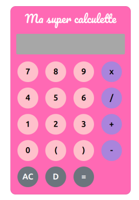

# Ma Super Calculette



Ma Super Calculette is a responsive calculator application built using HTML, CSS, and Bootstrap. This project is part of a school exercise at Ada Tech Schoold to practice building user interfaces with web technologies.

## Features

- **Responsive Design**: The calculator layout adjusts according to screen size using Bootstrap's grid system.
- **Basic Arithmetic Operations**: Users can perform addition, subtraction, multiplication, and division.
- **Clear and Delete Functions**: The calculator includes an "AC" button to clear all inputs and a "D" button to delete the last entered value.
- **Aesthetic Design**: The project includes custom styles and uses the Pacifico font for a fun, engaging look.

## Technologies Used

- **HTML5**: Structure and layout of the calculator.
- **CSS3**: Custom styles for buttons and the display screen.
- **Bootstrap 5**: Used for the responsive grid system and button styling.
- **JavaScript**: To handle the calculator's functionality (coming soon if not yet implemented).

## Installation

To run this project locally, simply clone the repository and open the `index.html` file in your web browser.

```bash
git clone https://github.com/yourusername/ma-super-calculette.git
cd ma-super-calculette


